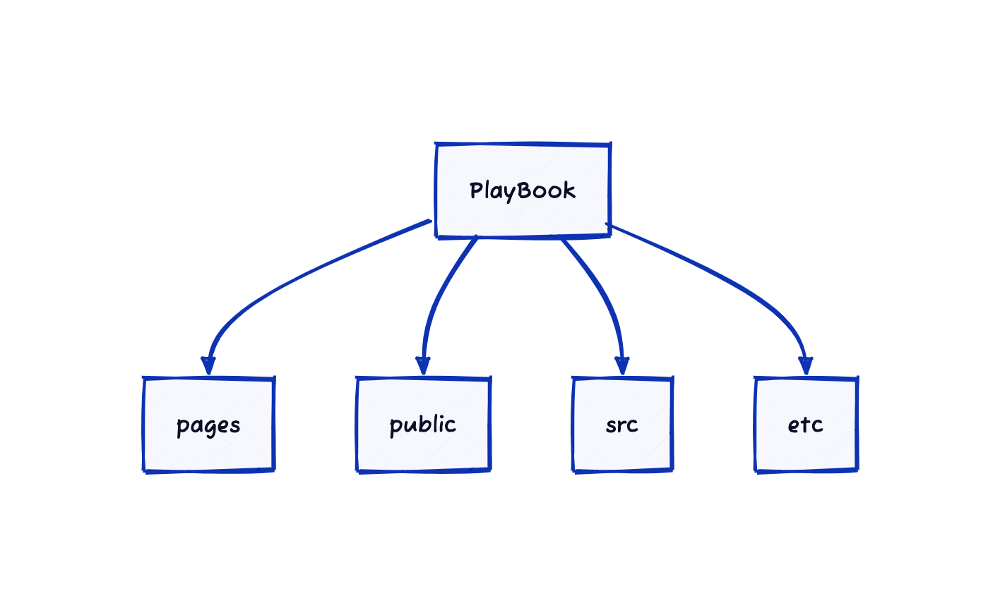
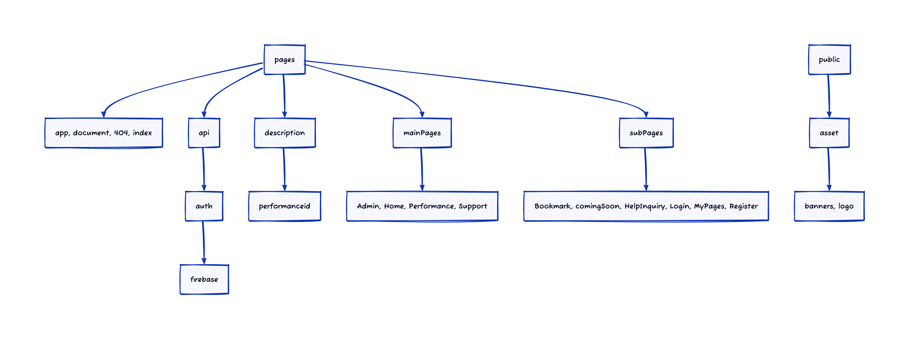
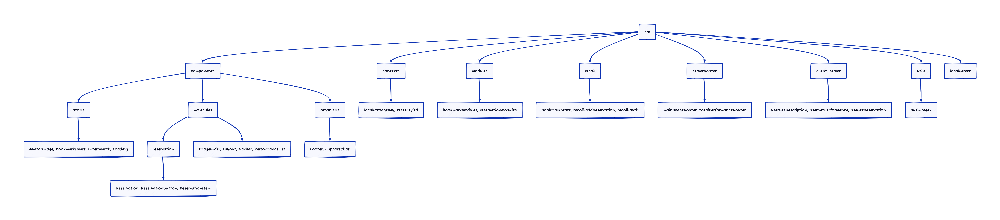
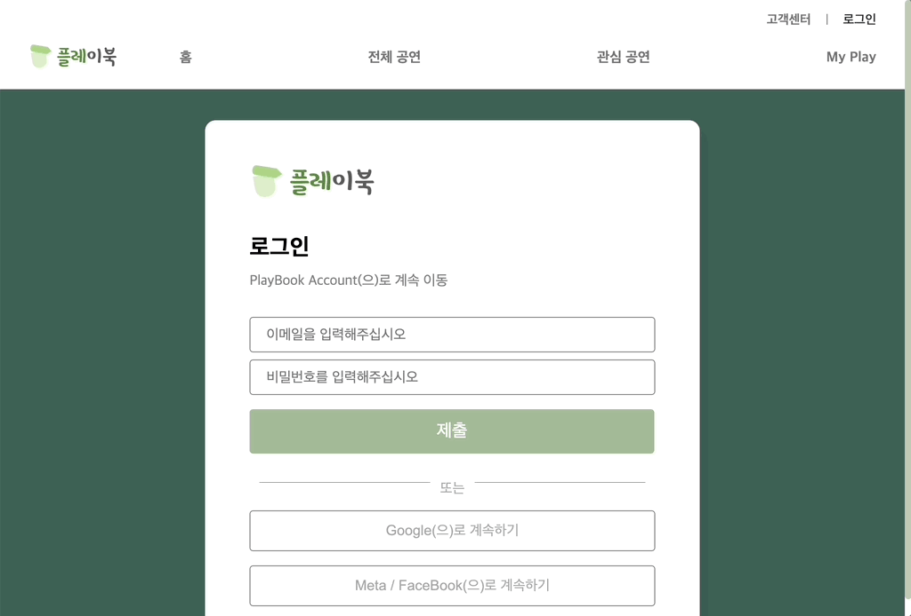
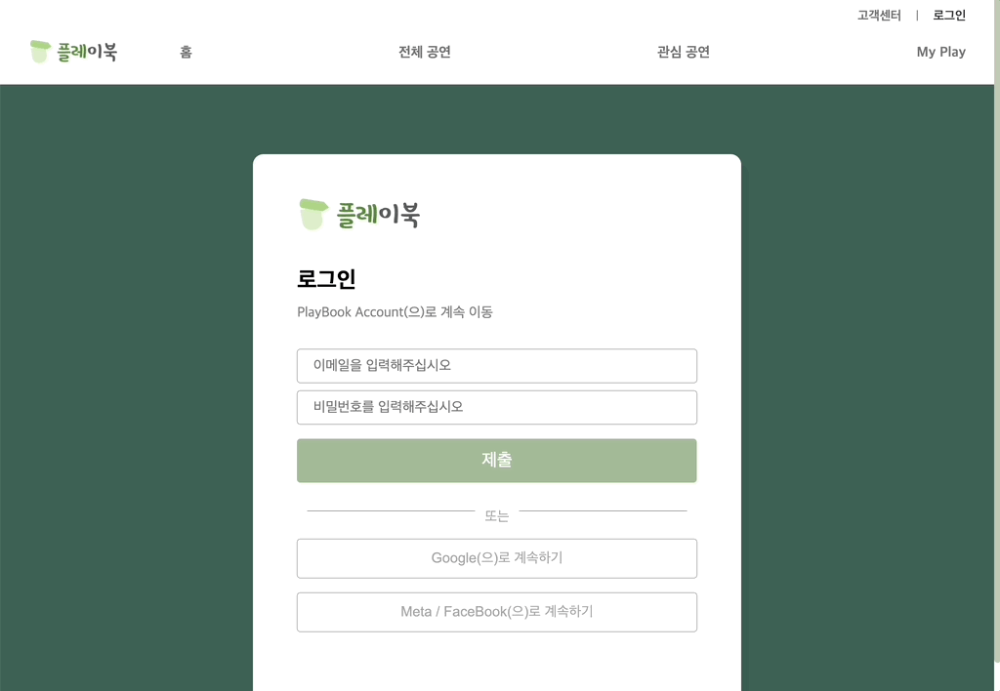
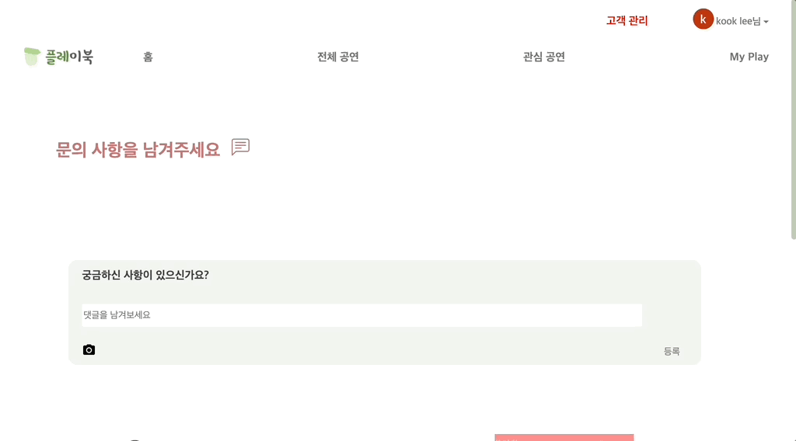

# Team_PlayBook

### Period (23.01.14 ~ 23.02.16)

- 기획 및 프로젝트 셋업 (23.01.14 ~ 23.01.17)
- 프로젝트 작업 (23.01.17 ~ 23.02.16)

<br>

## Index

### 1. 기획서 및 프로젝트 셋업 (초기 청사진)

### 2. PlayBook 소개

### 3. Stacks

### 4. 주요 기능

### 5. 주요 기능 상세 설명

### 6. Co-workers

### 7. 프로젝트 후기

<br>

## 1. 기획서 및 프로젝트 셋업 (초기 청사진)

### Setting





<br>

### Git

#### 1). Git Flow : main - develop - feature

#### 2). Git Convention

```js
- FEAT : 새로운 기능의 추가
- FIX: 버그 수정
- DOCS: 문서 수정
- STYLE: 스타일 관련 기능(코드 포맷팅, 세미콜론 누락, 코드 자체의 변경이 없는 경우)
- REFACTOR: 코드 리펙토링
- TEST: 테스트 코트, 리펙토링 테스트 코드 추가
- CHORE: 빌드 업무 수정, 패키지 매니저 수정(ex .gitignore 수정 같은 경우)
```

<br>

### Unify composition

```jsx
*** 경로 설정
- 상대 경로

*** Atomic Design 적용
- Atom, moelcules 너무 신경쓰지말고 컴포넌트 재사용 단위로 신경쓸 것

*** 파일 셋업
- 상태관리 / API / 모듈: 소문자로 시작 + 카멜
- 컴포넌트 / Pages: 대문자 + 카멜
- 폴더명: 소문자만

*** 코드 작성
- 주석: 상세하게
- 변수: 특정 의미를 갖도록 네이밍

👉🏻 변수, state : 소문자 카멜케이스
    const myData = 10; // 주석 자세히

👉🏻 function : 소문자 카멜케이스 && arrow function
    const myFunc = () => {...} // 주석 자세히

👉🏻 고유Key : NEXT_APP\_대문자\_언더바
    const NEXT_APP_EXAMPLE_KEY = process.env.NEXT_APP_EXAMPLE_KEY;

Etc

*** Yarn setting
*** Webpack, Vercel
*** CSS Library : emotion styled
*** Styling : Root Color 설정
*** 상태 관리 라이브러리 : recoil
*** 서버 통신 : FireBase

```

<br>
<br>

## 2. PlayBook 소개


<span>'플레이북'은 영단어 **Play**(공연 하다, 놀이, 즐기다)와 **Book**(예약 하다)의
의미를 착안하여 **놀이처럼 즐기면서 예약하다**의 의미를 덧붙여 만든 합성어입니다.
따라서, 색상은 피로감을 줄이며 산뜻한 느낌으로 다가갈 수 있도록 그린, 화이트 계열을 선택했습니다. 그리고 다른 최대한 웹사이트를 이용하는데 불편함을 줄이고자 분류 카테고리를 통합하여 검색과 필터형식으로 '한 곳'에서 '한 눈'에 볼 수 있도록 타 공연사이트와 차별점을 두고 작업하였습니다.
</span>

<br>
<br>

## 3. Stacks

### FRONTEND

|                                                       Next.js                                                       |                                                 React                                                 |                               Styled</br>Component                                |                                                 esLint                                                 |                                                 Prettier                                                 |
| :-----------------------------------------------------------------------------------------------------------------: | :---------------------------------------------------------------------------------------------------: | :-------------------------------------------------------------------------------: | :----------------------------------------------------------------------------------------------------: | :------------------------------------------------------------------------------------------------------: |
|  |  | </div> |  |  |

<br>

### BACKEND

|                                                         FireBase                                                         |                                                Nodejs                                                 |
| :----------------------------------------------------------------------------------------------------------------------: | :---------------------------------------------------------------------------------------------------: |
|  |  |

<br>
<br>

## 4. 주요 기능

#### 1) 메인 화면

- 공연 API의 일부분을 받아와서 캐러셀 형식으로 User에게 정보 제공
- Pages 서버사이드랜더링(SSR)

#### 2) 공연 소개

- Node 서버와 연결하여 XML -> JSON 형식으로 변환
- API 장르에 따른 필터링 정보 제공
- 보고 싶은 공연을 찾을 수 있도록 검색기능 제공
- 캘린더를 통해 희망 일자 설정
- 북마크 기능을 제공
- 예약하기 기능을 제공해서 마이페이지와 연동

#### 3) 상세페이지

- API의 상세 정보들 제공

#### 4) 로그인

- Firebase 기반으로 Email, Password 서버에 요청 -> 처리
- Firebase 기반의 소셜 네트워크 Google, Meta(Facebook) 로그인 서버에 요청 -> 처리
- 신규 고객일 경우, 회원가입 진행
- Firebase database 기반으로 어드민 계정 생성
- Firebase Auth 정보, router.query 전달

#### 5) 회원 가입

- 회원 가입 시, 각 항목 유효성 검사
- 모든 항목 유효성 검사 통과 -> Firebase Authentication 계정 생성
- 로그인 후 -> Toast 알림과 함께 user 정보 전체 페이지에 전달

#### 6) 마이페이지

- Firebase 이메일로 비밀번호 변경 링크 받기
- Firebase 비밀번호 업데이트
- 메인 페이지, 공연 예약 목록 -> 마이페이지에 위치
- 예약 목록 공연 삭제

#### 7) 고객 센터

- Cloud FireStore collection(text, id, createdAt, attachmentURL) 제공
- Storage를 기반한 이미지 저장
- user 정보에 따른 user.photoURL, userDisplayName 비동기 처리
- user 정보에 따른 edit, delete 기능 처리

<br>
<br>

## 5. 주요 기능 이미지 첨부

#### 메인 화면

  <br>
  
  <br>
    <br>

#### 공연 소개

  <br>
  
  <br>
    <br>
  
#### 상세페이지
<br>
  <br>
  
  <br>
    <br>

#### 북마크

<br>
  <br>
  
  <br>
    <br>

#### 공연 예약

<br>
  <br>
  
  <br>
    <br>

#### 로그인

<br>
  <br>
  
  <br>
    <br>

#### 회원 가입

<br>
  <br>
  
  <br>
    <br>

#### 고객센터

<br>
  <br>
  
  <br>
  <br>

## 협업 🤝

#### PlayBook project\_작업 공정

[기능구현 현황리스트](https://www.notion.so/edbb97ee7ac147f8bf4ef688e3792007)

⬆️ 작업 세부 사항 Notion 기록
<br>

#### co-worker

- 이인재 : https://github.com/llinjae
- 김다빈 : https://github.com/Dabiny
- 이종국(본인) : https://github.com/JKKook
# play_book_vercel_test
